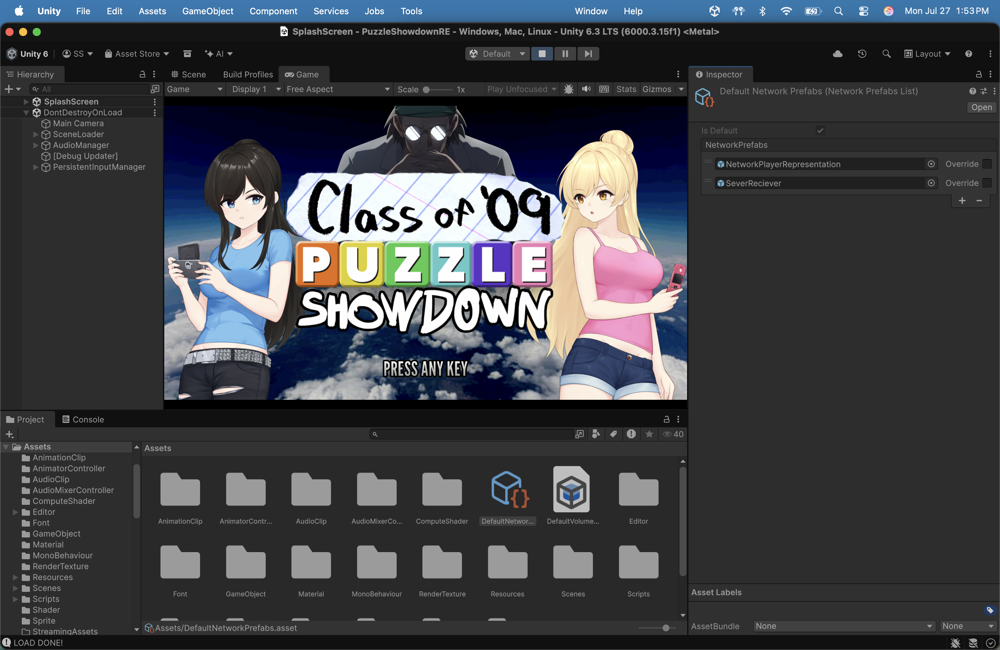
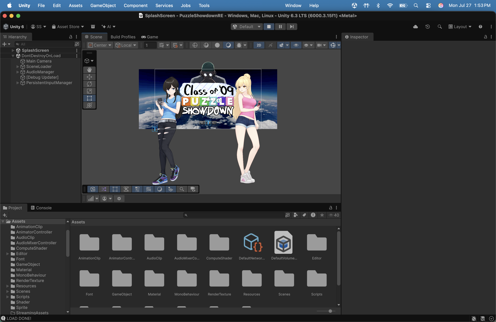
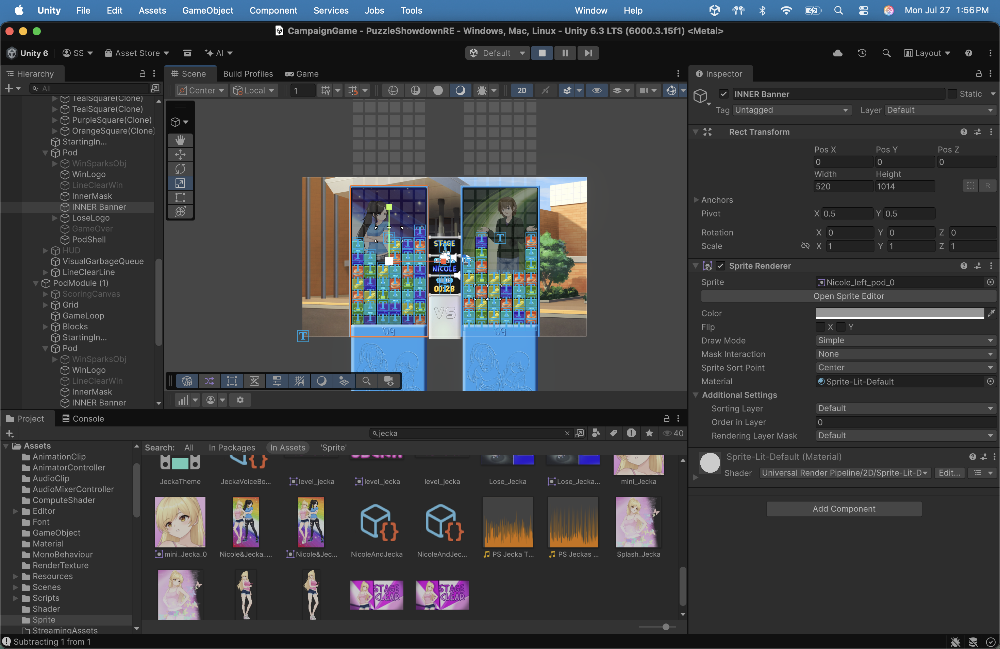

# Class of '09: Puzzle Showdown [Reverse Engineered]

Project is fully functional 1:1 with some of my own bug fixes and additions

---

## Ren'Py Player — running a shipped Ren'Py game inside Unity

This branch adds a **Ren'Py interpreter written from scratch in C#**, living entirely in
[`Assets/Scripts/RenPY`](Assets/Scripts/RenPY). It takes the *compiled, shipped* files of a
real Ren'Py game — no source, no re-authoring, no export step — and plays them in Unity.

The test subject is **Class of '09: Flip Side**: 1.0 GB of assets, 107 labels, 576 images,
40 screens, and 7,370 blocks of embedded Python.

```
.rpyc  →  zlib + Python pickle  →  Ren'Py AST  →  engine  →  Unity
```

Nothing is transpiled ahead of time. The game is parsed and interpreted at runtime.

### Why this is not a small thing

A `.rpyc` file is not a script — it is a **pickled Python object graph** of Ren'Py's own AST,
zlib-compressed inside a slot container. Reading it meant building, in plain C#:

- **A Python unpickler** covering protocols 0–4, reconstructing Ren'Py's `__slots__`-based
  node objects (which serialise as `(None, slots_dict)` state tuples).
- **A Python interpreter** — lexer, parser, tree-walking evaluator. Real `def` with
  closures/`*args`/`**kwargs`, `class` with inheritance, `try`/`except`/`finally`,
  comprehensions, f-strings, `%`-formatting, slicing, unpacking, generators.
  This is the load-bearing part: Flip Side's dialogue is **7,141 embedded Python blocks**,
  not `say` statements.
- **The Ren'Py runtime**: labels, jumps/calls, menus, `scene`/`show`/`hide` with layers,
  tags and z-order, ATL animation with Ren'Py's easing warpers, transitions, text tags,
  channel-based audio, video, and the screen-language system that draws the game's menus.

Fidelity came from reading Ren'Py's own source rather than guessing. Two examples:

- `.rpyc` files store every statement's `next` pointer as **null** — Ren'Py links the
  execution chain *after* unpickling. `chain_block` is ported rule-for-rule, including
  `while` chaining its body back to itself.
- Flip Side keeps voice-over in sync by calling `renpy.music.get_pos()` and reseeking only
  when it drifts past a tolerance. Stubbing that function out made the game restart its
  voice track on **every line**. Implementing it properly took restarts from 994 → 39.

### Built for IL2CPP / Android

No Python runtime, no `Reflection.Emit`, no code generation, no `dynamic`. It is ordinary
C# that survives AOT compilation. Unity's own `DeflateStream` handles zlib; there are no
third-party dependencies.

Ren'Py's script semantics are synchronous — `renpy.say()` does not return until the player
clicks. Rather than distort the interpreter into continuation-passing style, the script runs
on **its own thread**; work that touches Unity is marshalled to the main thread, and blocking
calls park the script thread until the interaction completes.

### Verified, not assumed

Everything below `Unity/` compiles and runs **without Unity**, so the engine is regression
tested headlessly against the real game on every change:

| Check | Result |
|---|---|
| Python interpreter tests | **103 / 103** |
| Real Python blocks parsed from the game | **7,370 / 7,370** |
| Full playthrough to an ending | **994 dialogue lines, 603 image shows, 1,059 audio cues, 3 videos** |
| Script errors | **0** |
| Unresolved assets | **0** |
| Time to load, init and run that playthrough | **~0.5 s** |

### What works

Statements (`label`, `jump`, `call`, `menu`, `if`/`while`, `scene`/`show`/`hide`, `with`,
`image`, `transform`, `define`/`default`, `python`, `screen`, `style`), the built-in user
statements (`play`/`queue`/`stop`/`pause`/`voice`/`window`, `show`/`hide screen`), the
`renpy.*` API, `Character`, `config`/`gui`/`persistent`/`preferences`, displayables,
positions, transitions, ATL, text tags with `[variable]` interpolation, Ren'Py's
`<from N to N loop N>` audio clauses, screen language with a working action system, save
slots, and persistent data across sessions.

Ren'Py's real boot sequence is followed: `splashscreen → main menu → start`.

### Honest limits

- Ren'Py's **style system** (inheritance, `style_prefix`, `Frame` borders) is not implemented,
  so screen layout is approximate rather than pixel-exact.
- ATL `parallel` runs only its first track; `time`/`event` are ignored.
- `.rpa` archives are not read — loose-file games only.
- Rollback is not implemented.

Full architecture notes, usage and Android setup: **[Assets/Scripts/RenPY/README.md](Assets/Scripts/RenPY/README.md)**

---

### Credits

Reverse Engineering:
Juelz Irons (Xera)

Lead Programmer:
Emmy Hammarström (EmmyDev)

Enemy AI + Additional Programming:
Sam Ahlbom

Writing + Creator of series:
Max Field


### In-Editor Screenshots






